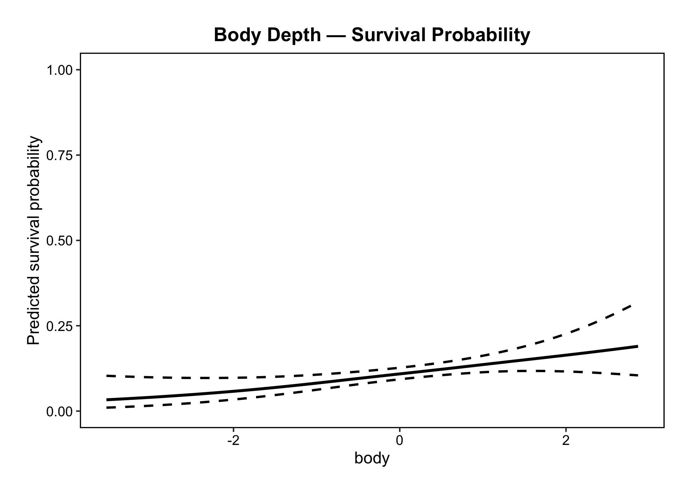
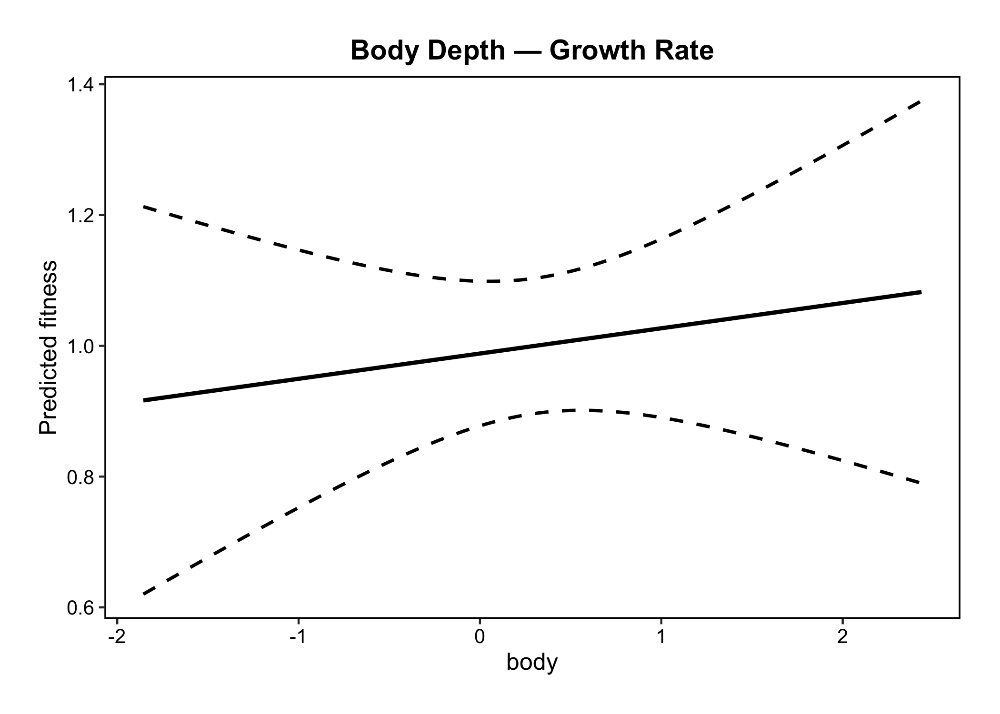
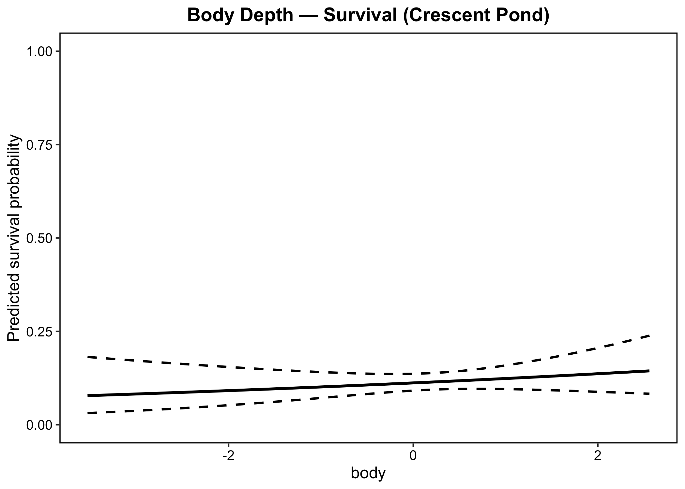
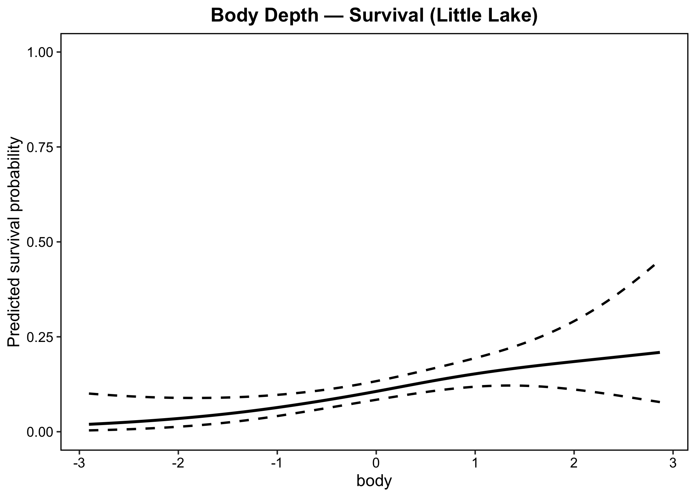
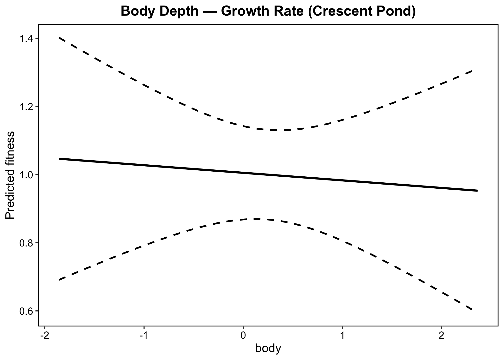
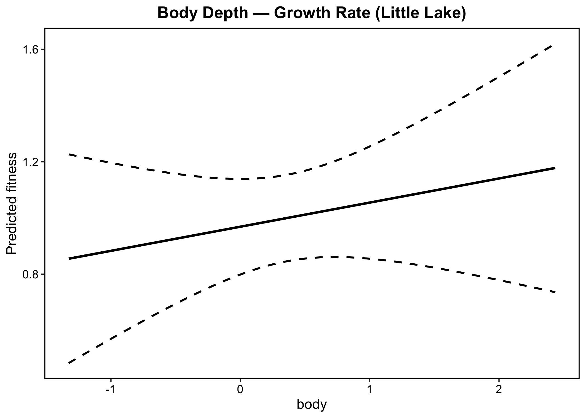

## Title: "Evolutionary Selection Analysis: Caribbean Pupfish"

### 1. Introduction

The adaptive radiation of pupfishes (*Cyprinodon* spp.) on San Salvador Island, Bahamas, represents one of the most rapid and spectacular examples of trophic diversification in vertebrates. Within the past 10,000 years, three sympatric species have evolved from a generalist ancestor: the generalist (*C. variegatus*), the scale-eater (*C. desquamator*), and the molluscivore (*C. brontotheroides*). These species exhibit extreme morphological divergence, particularly in jaw length, nasal protrusion, and body depth.

### 1.1 Study Design and Sample Selection

The dataset contains F2 hybrid individuals from multiple experimental treatments across two lakes. The full sample distribution by treatment and lake is as follows:

| Treatment | Crescent Pond | Little Lake | Description |
|-----------|--------------|-------------|-------------|
| H | 796 | 875 | High-density field enclosure |
| L | 96 | 98 | Low-density field enclosure |
| bozo | 20 | 22 | Additional treatment |
| bull | 31 | 37 | Additional treatment |
| norm | 50 | 30 | Additional treatment |
| **Total** | **993** | **1,062** | |

**Why only high-density (H) enclosures?**

This analysis follows Martin & Wainwright (2013) in restricting analyses to high-density enclosures for three reasons:

1. **Statistical power**: High-density enclosures contain the largest sample sizes (n = 796 and n = 875), providing sufficient power to detect complex nonlinear fitness surfaces and multiple fitness peaks.

2. **Consistency with original study**: Martin & Wainwright (2013) explicitly focused on high-density enclosures, noting that low-density treatments had insufficient sample sizes for reliable fitness surface estimation. Using the same treatment ensures our results are directly comparable to the published fitness landscapes.

The final analytical dataset therefore comprises **n = 1,671 individuals** (Crescent Pond: 796, Little Lake: 875) from high-density enclosures only.

### 1.2 Fitness Components

| Fitness Component | Column | Type | Description | n |
|------------------|--------|------|-------------|---|
| Survival | `survival` | Binary (0/1) | Whether the individual survived the 3-month field enclosure period | 1,671 |
| Growth rate | `ln.growth` | Continuous | Log-transformed growth rate; non-zero values indicate survivors only | 188 (CP: 91, LL: 97) |

### 1.3 Morphological Traits

Six functional morphological traits are analyzed, corresponding to those with the highest loadings on the discriminant axes separating the three parental species (Martin & Wainwright 2013, Table 3). All traits are size-corrected and standardized to mean = 0, SD = 1 prior to analysis, following Lande & Arnold (1983):

| Trait | Column | Mean | SD | Functional Role |
|-------|--------|------|----|-----------------|
| Lower jaw length | `jaw` | 0 | 1 | Primary determinant of bite reach; threefold larger in scale-eaters |
| Premaxilla length | `pmx` | 0 | 1 | Upper jaw size; co-varies with lower jaw in jaw functional module |
| Nasal protrusion | `nasal` | 0 | 1 | Defines molluscivore specialist morphology; unique skeletal innovation |
| Nasal angle | `noseangle` | 0 | 1 | Shape of nasal module; separates molluscivore from other species on LD2 |
| Body depth | `body` | 0 | 1 | Swimming performance and stability; highest univariate nonlinearity |
| Orbit diameter | `eye` | 0 | 1 | Visual capability; loads on both discriminant axes |

Script: `R/scripts/test_fish.R`

---

### 2. Data Preparation

Four analytical datasets are prepared using `prepare_selection_data()`:

| Dataset | Fitness | Grouping | Relative Fitness | n |
|---------|---------|----------|-----------------|---|
| `prepared_binary` | Survival (0/1) | Pooled | No | 1,671 |
| `prepared_binary_group` | Survival (0/1) | By lake | No | 1,671 (CP: 796, LL: 875) |
| `prepared_continuous` | ln.growth | Pooled | Yes (w = W/W̄) | 1,671 |
| `prepared_continuous_group` | ln.growth | By lake | Yes (within lake) | 1,671 (CP: 796, LL: 875) |

---

### 3. Selection Differentials

#### 3.1 Results Summary

| Trait | Binary S (Overall) | Binary S (CP) | Binary S (LL) | Continuous S (Overall) | Continuous S (CP) | Continuous S (LL) |
|-------|-------------------|---------------|---------------|----------------------|-------------------|-------------------|
| jaw | -0.016 | -0.011 | -0.020 | -0.082 | +0.044 | -0.184 |
| pmx | -0.008 | -0.001 | -0.016 | -0.010 | +0.088 | -0.089 |
| nasal | -0.000 | -0.001 | +0.001 | -0.072 | -0.051 | -0.090 |
| noseangle | +0.007 | -0.001 | +0.015 | +0.075 | -0.021 | +0.154 |
| body | **+0.034** | +0.028 | +0.040 | **+0.330** | +0.228 | +0.414 |
| eye | -0.003 | -0.017 | +0.009 | **-0.171** | -0.226 | -0.127 |

CP = Crescent Pond, LL = Little Lake

#### 3.2 Key Findings

**Body depth shows the strongest and most consistent selection:**
- Binary S = +0.034: individuals with greater body depth had higher survival probability across both lakes
- Continuous S = +0.330: strong positive selection on growth rate — the strongest signal among all traits

**Eye size shows consistent negative selection on growth:**
- Continuous S = -0.171 overall; consistent across both lakes (CP: -0.226, LL: -0.127), suggesting individuals with larger eyes grew more slowly

**Jaw and pmx show opposite directions between lakes for growth:**
- jaw: Crescent Pond S = +0.044 vs Little Lake S = -0.184
- pmx: Crescent Pond S = +0.088 vs Little Lake S = -0.089
- This reversal suggests context-dependent selection on jaw morphology across lakes, consistent with Martin & Wainwright (2013)

**Binary vs continuous fitness tell different stories:**
- Binary (survival) selection differentials are generally weak (|S| < 0.04)
- Continuous (growth) selection differentials are much stronger (|S| up to 0.33)
- This suggests growth rate is a more sensitive fitness measure than survival for detecting selection in this system

#### 3.3 Interpretation

Selection differentials represent the **total** selection on each trait, including indirect effects through correlated traits. For example, the negative S for jaw under continuous fitness may partly reflect indirect selection through its correlation with other traits, rather than direct selection on jaw size itself. Partial regression coefficients ($\beta$, Section 4) are needed to disentangle direct from indirect selection.

---
### 4. Linear Selection Gradients

#### 4.1 Significant Linear Gradients (p < 0.05, Overall)

**Binary fitness (survival):**

| Trait Pair | Term | $\beta$ | p-value | |
|------------|------|---------|---------|--|
| pmx + body | body | +0.044 | 0.0001 | *** |
| jaw + body | body | +0.038 | 0.0003 | *** |
| body + eye | body | +0.028 | 0.0020 | ** |
| nasal + body | body | +0.026 | 0.0030 | ** |
| noseangle + body | body | +0.025 | 0.0063 | ** |
| pmx + body | pmx | +0.026 | 0.0208 | * |
| jaw + body | jaw | +0.020 | 0.0459 | * |

**Continuous fitness (growth rate):**

| Trait Pair | Term | $\beta$ | p-value | |
|------------|------|---------|---------|--|
| noseangle + eye | eye | -0.163 | 0.0034 | ** |
| nasal + eye | eye | -0.161 | 0.0036 | ** |
| body + eye | eye | -0.160 | 0.0039 | ** |
| jaw + eye | eye | -0.152 | 0.0069 | ** |
| pmx + eye | eye | -0.155 | 0.0121 | * |
| pmx + body | pmx | +0.170 | 0.0266 | * |

#### 4.2 Key Findings

**Body depth — positive directional selection on survival:** Body depth shows significant positive $\beta$ across all five trait pairs (p < 0.007), indicating robust direct selection for deeper-bodied individuals independent of which other trait is included. This is the strongest and most consistent signal in the dataset.

**Orbit diameter — negative directional selection on growth:**
Eye size shows significant negative $\beta$ across all five trait pairs for growth rate (p < 0.013), suggesting that individuals with larger eyes grew more slowly among survivors. This is consistent across all trait combinations,indicating a robust direct effect rather than an artefact of trait correlations.

**Jaw and pmx — context-dependent selection on survival:**
Jaw length and premaxilla length show marginal positive selection on survival only when paired with body depth (p ≈ 0.02 - 0.05), suggesting their effects are weak and may reflect partial collinearity with body depth.

#### 4.3 Binary vs Continuous Fitness

Selection on survival and growth rate operate on largely different traits:
- **Survival** is primarily predicted by body depth (positive)
- **Growth rate** is primarily predicted by eye size (negative)

This dissociation suggests that the two fitness components capture different aspects of performance in the field enclosures, consistent with Martin & Wainwright (2013) who noted that survival and growth reflect distinct ecological processes.

---

### 5. Nonlinear Selection Gradients

#### 5.1 Significant Nonlinear Gradients (p < 0.05, Overall)

**Quadratic selection ($\gamma_{ii}$):**

| Trait Pair | Term | $\gamma$ | p-value | Type |
|------------|------|---------|---------|------|
| jaw + nasal | jaw² | -0.032 | 0.020 | Stabilizing |
| jaw + noseangle | jaw² | -0.031 | 0.029 | Stabilizing |

**Correlational selection ($\gamma_{ij}$):**

| Trait Pair | Term | $\gamma_{ij}$ | p-value | Interpretation |
|------------|------|--------------|---------|----------------|
| nasal + noseangle | nasal × noseangle | -0.023 | 0.020 | Selection favours negative correlation — large nasal protrusion with small angle, or vice versa |
| body + eye | body × eye | -0.020 | 0.029 | Selection favours negative correlation — deep body with small eye, or vice versa |
| jaw + eye | jaw × eye | +0.018 | 0.035 | Selection favours positive correlation — large jaw with large eye, or small jaw with small eye |

#### 5.2 Key Findings

**Stabilizing selection on jaw length:**
Jaw length shows significant stabilizing selection ($\gamma < 0$) when paired with nasal protrusion or nasal angle, indicating that intermediate jaw sizes have the highest survival probability. This is consistent with the original fitness landscape, where the generalist fitness peak (intermediate jaw size) has higher survival than extreme phenotypes.

**Correlational selection on nasal module:**
Negative correlational selection between nasal protrusion and nasal angle ($\gamma_{nasal \times noseangle} = -0.023$) suggests that selection favours trait combinations where these two components of the nasal module are negatively correlated, rather than both being large or both being small. This may reflect biomechanical constraints on the nasal protrusion structure unique to the molluscivore.

**Body-eye trade-off:**
Negative correlational selection between body depth and eye size ($\gamma_{body \times eye} = -0.020$) indicates selection favouring deep-bodied individuals with small eyes, or shallow-bodied individuals with large eyes. 
Combined with the strong positive $\beta_{body}$ and negative $\beta_{eye}$ for growth rate, this suggests a performance trade-off between body form and visual investment.

#### 5.3 Absence of Nonlinear Selection on Growth Rate

The absence of significant nonlinear selection on growth rate may reflect the smaller sample size of survivors (n = 188 vs n = 1,671 for survival), reducing statistical power to detect quadratic and interaction effects. Alternatively, growth rate among survivors may be shaped primarily by linear performance gradients rather than complex trait interactions.

### 6. Disruptive and Stabilizing Selection

#### 6.1 Results Summary

| Trait | Fitness | $\beta$ | p($\beta$) | $\gamma$ | p($\gamma$) | Selection |
|-------|---------|---------|-----------|---------|------------|-----------|
| jaw | Binary | -0.010 | 0.304 | **-0.031** | **0.025** | **Stabilizing** |
| jaw | Continuous | -0.141 | 0.121 | -0.094 | 0.521 | None |
| pmx | Binary | -0.007 | 0.423 | -0.029 | 0.052 | None (marginal) |
| pmx | Continuous | -0.124 | 0.142 | -0.034 | 0.822 | None |
| nasal | Binary | -0.007 | 0.390 | -0.008 | 0.473 | None |
| nasal | Continuous | +0.097 | 0.171 | +0.002 | 0.983 | None |
| noseangle | Binary | +0.008 | 0.495 | +0.007 | 0.614 | None |
| noseangle | Continuous | -0.038 | 0.715 | +0.027 | 0.763 | None |
| body | Binary | **+0.027** | **0.002** | -0.011 | 0.204 | None |
| body | Continuous | -0.037 | 0.707 | -0.039 | 0.807 | None |
| eye | Binary | -0.003 | 0.720 | -0.002 | 0.860 | None |
| eye | Continuous | **+0.208** | **0.003** | -0.055 | 0.581 | None |

#### 6.2 Key Findings

**Stabilizing selection on jaw length (survival):**
Jaw length shows significant stabilizing selection for survival ($\gamma = -0.031$, p = 0.025), indicating that individuals with intermediate jaw sizes had the highest survival probability. This is consistent with the multivariate results showing jaw² is negative in pairwise analyses, and with the original fitness landscape where the generalist fitness peak (intermediate jaw) has higher survival than extreme phenotypes.

**Strong directional selection — no significant nonlinear component:**
- Body depth shows strong positive directional selection on survival ($\beta = +0.027$, p = 0.002) but no significant quadratic term, suggesting a monotonically increasing relationship between body depth and survival.
- Eye size shows strong positive directional selection on growth rate ($\beta = +0.208$, p = 0.003) — note this is the **univariate** effect; the multivariate $\beta_{eye}$ was negative (Section 4), suggesting indirect effects through correlated traits drive the multivariate result.

**Marginal stabilizing selection on pmx (survival):** 
Premaxilla length shows marginal stabilizing selection ($\gamma = -0.029$, p = 0.052), just below the conventional threshold, suggesting possible selection for intermediate upper jaw sizes.

---

### 7. Univariate Fitness Function for Body Depth 

<table>
<tr>
<td><b>(A) Body Depth — Survival (Overall)</b> </td>
<td><b>(B) Body Depth — Growth Rate (Overall)</b> </td>
</tr>
<tr>
<td><b>(C) Body Depth — Survival (Crescent Pond)</b> </td>
<td><b>(D) Body Depth — Survival (Little Lake)</b> </td>
</tr>
<tr>
<td><b>(E) Body Depth — Growth Rate (Crescent Pond)</b> </td>
<td><b>(F) Body Depth — Growth Rate (Little Lake)</b> </td>
</tr>
</table>

**(A) Survival — Overall (n = 1,671):** Body depth shows a consistent positive linear relationship with survival probability across both lakes combined. Survival probability increases from ~4% at the smallest body sizes to ~18% at the largest, indicating strong directional selection favouring deeper-bodied individuals.

**(B) Growth Rate — Overall (n = 188 survivors):** A positive but weak relationship between body depth and relative growth rate is observed overall, with wide confidence intervals reflecting the small sample size of survivors.

**(C) Survival — Crescent Pond (n = 796):** The positive relationship between body depth and survival is weak in Crescent Pond, with a nearly flat spline and narrow confidence intervals. Selection on body depth for survival is substantially weaker here than in Little Lake.

**(D) Survival — Little Lake (n = 875):** A stronger positive relationship between body depth and survival is observed in Little Lake, with survival probability increasing more steeply with body depth compared to Crescent Pond, suggesting greater directional selection in this population.

**(E) Growth Rate — Crescent Pond (n = 91 survivors):** A slightly negative relationship is apparent, though confidence intervals are wide and the trend is not significant. A few high-fitness outliers at intermediate body sizes drive the positive selection differential (S = +0.228) despite the apparent flat-to-negative spline trend.

**(F) Growth Rate — Little Lake (n = 97 survivors):** A positive relationship between body depth and growth rate is observed, consistent with the selection differential (S = +0.414), indicating that deeper-bodied survivors grew faster in Little Lake.

**Key observation:** The direction of selection on body depth for growth rate differs between lakes — negative in Crescent Pond but positive in Little Lake — suggesting context-dependent selection consistent with the complex fitness landscapes described by Martin & Wainwright (2013). In contrast, selection on survival is consistently positive across both lakes, indicating that body depth is a robust predictor of survival regardless of lake environment.

